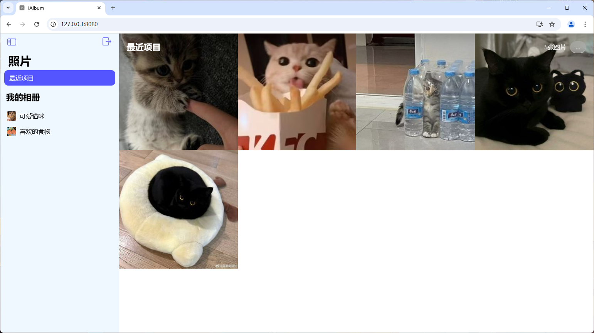
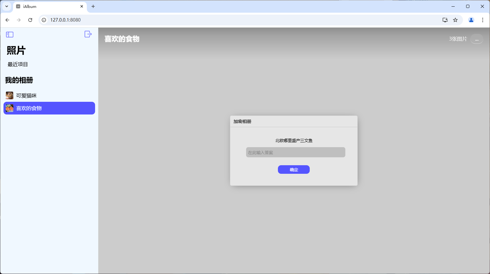

## 特性

- 纯静态，无需后端，部署简单，性能极佳
- 支持采用 GitHub Actions 进行 CI/CD
- 可单独为相册设置问题和答案

## 预览





## 快速上手

首先，你需要在 GitHub 上选择 `Use this template` 按钮，然后填写相应信息，创建一个新的仓库。将 `./vue.config.js` 和 `./src/js/utils.js`中的 `publicPath` 设置为你仓库的名称（部署路径，如果你打算部署在根上则设置为 `/` 或直接删除该行），编辑 `album` 目录中的 `meta.yml` 文件和里面的照片，然后直接提交到仓库，GitHub Actions 会自动构建并部署到 GitHub Pages。

### album 目录结构

```
./album
├── meta.yml          # 相册信息
└── travel            # 照片目录，与 meta.yml 中的相册名对应
    ├── IMG_0001.jpg  # 照片文件，文件名可自定义
    └── IMG_0010.jpg
```

### meta.yml 示例

```yaml
version: 1.0                 # 配置文件版本，默认 1.0
album:
  - name: travel             # 相册文件夹名（注意不能为`default`）
    friendly_name: 旅行      # 相册显示名
    preview: IMG_0001.jpg    # 预览图（一定要填写实际存在的文件名）
  - name: secret
    friendly_name: 秘密相册
    password: 2008           # 相册密码（可选）
    hint: 我出生的年份       # 相册密码提示问题（可选）
    preview: IMG_1010.jpg
```

## Changelog

- Forked by [JiJi](https://github.com/mmdjiji), 2024.11
- Created by [Miyuki](https://github.com/acane77), 2020.1, Licensed under MIT license
