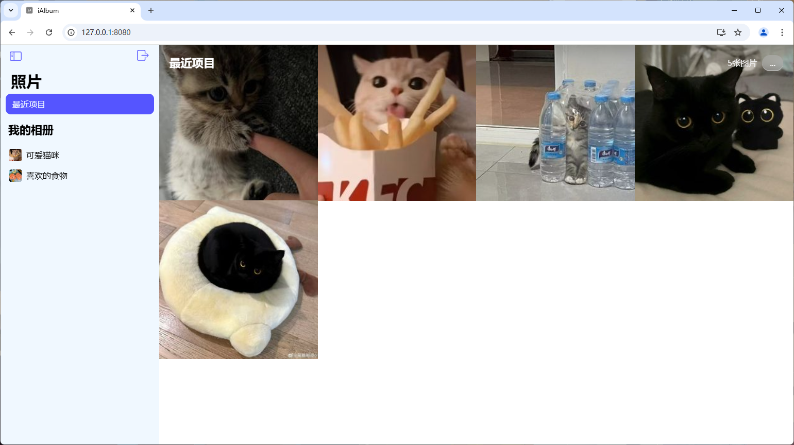
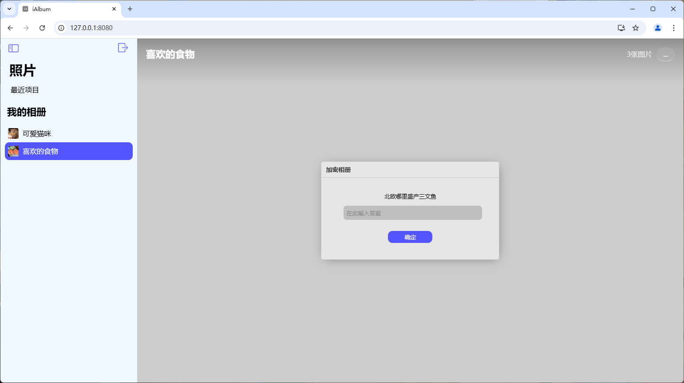

[简体中文](./README_zh.md) | English

## Features

- Fully static, no backend required, easy to deploy, excellent performance
- Supports CI/CD via GitHub Actions
- Allows setting a password and hint for individual albums

## Preview





## Quick Start

First, click the `Use this template` button on GitHub to create a new repository. Set the `publicPath` in `./vue.config.js` and `./src/js/utils.js` to your repository name (the deployment path; set it to `/` or remove the line if you plan to deploy at the root). Then edit the `meta.yml` file and photos in the `album` directory, and push to your repository. GitHub Actions will automatically build and deploy to GitHub Pages.

### Album Directory Structure

```
./album
├── meta.yml          # Album metadata
└── travel            # Photo directory, corresponds to the album name in meta.yml
    ├── IMG_0001.jpg  # Photo file, filename can be customized
    └── IMG_0010.jpg
```

### meta.yml Example

```yaml
version: 1.0                 # Config file version, default 1.0
album:
  - name: travel             # Album folder name (cannot be `default`)
    friendly_name: Travel    # Album display name
    preview: IMG_0001.jpg    # Preview image (must be an existing filename)
  - name: secret
    friendly_name: Secret Album
    password: 2008           # Album password (optional)
    hint: The year I was born  # Album password hint (optional)
    preview: IMG_1010.jpg
```

## Changelog

- Forked by [JiJi](https://github.com/mmdjiji), 2024.11
- Created by [Miyuki](https://github.com/acane77), 2020.1, Licensed under MIT license
